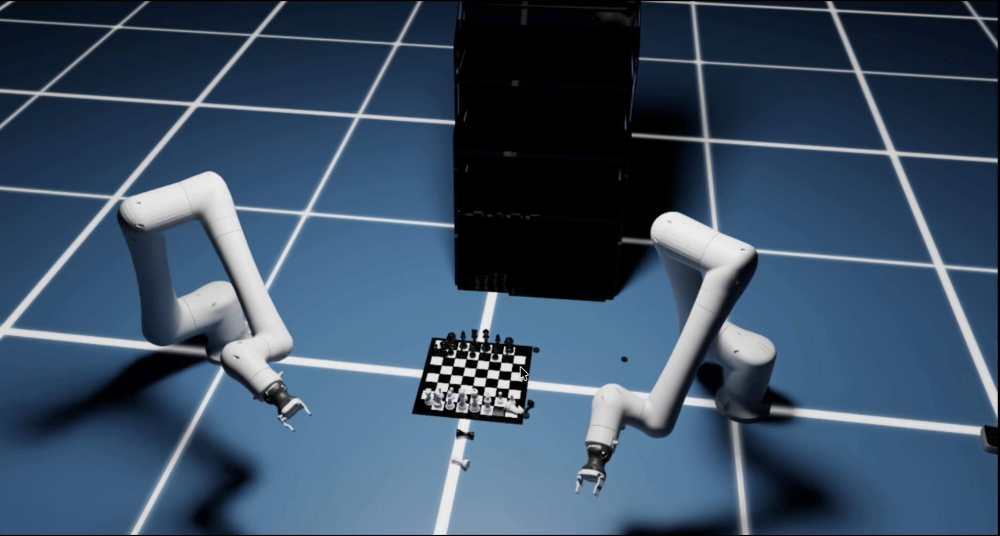

# Iron Giant: Dual-Robot Pick-and-Place Simulation 🤖🤖

A sophisticated Isaac Sim robotics simulation showcasing coordinated dual-robot operations for advanced pick-and-place tasks. This project demonstrates the future of industrial automation through multi-robot collaboration.



## 🎯 Project Vision

This hackathon project explores the potential of **multi-robot coordination** in industrial automation scenarios. By leveraging two synchronized robots working in tandem, we can achieve:

- **Enhanced productivity** through parallel task execution
- **Improved reliability** with redundant robot systems  
- **Complex manipulation tasks** requiring multi-arm coordination
- **Scalable automation** solutions for modern manufacturing

## 🏗️ Architecture Overview

The project follows a modular, object-oriented design built on NVIDIA Isaac Sim:

```
iron_giant/
├── simulation_world.py    # Main simulation orchestrator
├── robot.py              # Individual robot management & control
├── camera_manager.py     # Vision system for monitoring operations
└── main_world.py         # Entry point & scene setup
```

### Core Components

#### 🌍 SimulationWorld
- **Environment Management**: Sets up physics simulation, ground plane, and objects
- **Multi-Robot Orchestration**: Coordinates multiple robot instances
- **Scene Integration**: Manages USD asset loading and positioning
- **Camera Integration**: Provides visual monitoring and data capture

#### 🤖 Robot Class  
- **Modular Robot Control**: Individual robot instantiation and management
- **Pose Management**: Precise positioning and orientation control
- **Animation System**: Synchronized sinusoidal joint movements with phase offsets
- **Articulation Interface**: Direct joint position control for pick-and-place operations

#### 📷 CameraManager
- **Real-time Monitoring**: RGB and depth image capture
- **Data Collection**: Automated frame saving for analysis
- **Visual Feedback**: Distance measurements and spatial awareness

## 🎮 Pick-and-Place Scenario

### Dual-Robot Configuration

The simulation instantiates **two coordinated robots**:

```python
# Robot 1: Primary manipulator
robot1 = sim_world.add_robot(
    name="robot1",
    position=np.array([1.0, 0.0, 0.0]),
    orientation=np.array([0.7071, 0.0, 0.0, 0.7071]),
    phase_offset=0.0
)

# Robot 2: Secondary manipulator  
robot2 = sim_world.add_robot(
    name="robot2", 
    position=np.array([-1.0, 0.0, 0.0]),
    orientation=np.array([1.0, 0.0, 0.0, 0.0]),
    phase_offset=np.pi / 3  # 60° phase difference for coordination
)
```

### Interactive Environment

The workspace includes various objects that robots can interact with:

- **🎯 Target Cube**: Red dynamic cuboid for manipulation tasks
- **♟️ Chess Set**: Complex object requiring precision handling  
- **🖥️ GeForce RTX 3080**: Delicate electronic component simulation
- **🏗️ Stanley Stand**: Tool organization and storage simulation

### Coordination Strategy

- **Phase-Offset Animation**: Robots operate with synchronized but offset movements
- **Spatial Separation**: Strategic positioning prevents collision while enabling collaboration  
- **Complementary Operations**: One robot can pick while the other places
- **Visual Feedback Loop**: Camera system monitors operations for quality control

## 🚀 Quick Start

### Prerequisites
- NVIDIA Isaac Sim 4.5.0+
- Python 3.8+
- CUDA-compatible GPU

### Installation & Running

```bash
# Clone the repository
git clone --recurse-submodules https://github.com/sachinkum0009/iron-giant.git
cd iron-giant

# Run the dual-robot simulation
~/isaacsim/python.sh scripts/main_world.py [USD_ROBOT_PATH]

# Example with ABB Cobot
~/isaacsim/python.sh scripts/main_world.py library/ABB/CRB15000_10kg_152_v1/CRB15000_10kg_152/CRB15000_10kg_152.usd
```

### Command Line Arguments

```bash
python scripts/main_world.py <usd_path>
```

- `usd_path`: Path to robot USD file from the extensive robot library

## 🎨 Features

### ✨ Multi-Robot Coordination
- **Synchronized Movement**: Phase-offset joint control for coordinated operations
- **Independent Control**: Each robot maintains individual articulation control
- **Collision Avoidance**: Spatial positioning prevents inter-robot interference

### 📊 Advanced Monitoring
- **Real-time RGB Capture**: Visual monitoring of pick-and-place operations
- **Depth Sensing**: 3D spatial awareness for precise manipulation
- **Automated Logging**: Frame-by-frame operation recording
- **Distance Measurement**: Center-pixel depth analysis for quality control

### 🏭 Industrial Simulation
- **Realistic Physics**: Accurate object dynamics and robot interactions
- **Multi-Object Environment**: Complex workspace with various manipulation targets
- **Scalable Architecture**: Easy addition of more robots or objects
- **Production-Ready Code**: Clean, modular, and maintainable structure

### 🎬 Visual Capabilities  
- **Livestream Support**: Real-time visualization through Omniverse streaming
- **High-Quality Rendering**: Ray-traced lighting for photorealistic results
- **Configurable Display**: Adjustable resolution and rendering settings
- **Export Capabilities**: Image sequence generation for analysis


## 🙏 Acknowledgments

- **NVIDIA Isaac Sim**: For the powerful robotics simulation platform
- **Workr Labs**: For the comprehensive robot asset library  
- **Hackathon Organizers**: For the opportunity to showcase innovation
- **Open Source Community**: For the foundational tools and libraries

---

**Built with ❤️ for the future of robotics automation**

*This project demonstrates the potential of coordinated multi-robot systems in transforming industrial automation, making complex manipulation tasks more efficient, reliable, and scalable.*